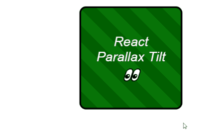

# React Tilt

[![npm version][npm-badge]][npm-url]
[![npm downloads][downloads-badge]][npm-url]
[![npm bundle size][size-badge]][size-url]
[![Open issues][issues-badge]][issues-url]
[![TypeScript][typescript-badge]][typescript-url]
[![semantic-release][semantic-badge]][semantic-url]

[![CI][lint-badge]][lint-url]
[![CI][tsc-badge]][tsc-url]
[![CI][build-badge]][build-url]
[![CI][test-badge]][test-url]
[![CI][test-e2e-badge]][test-e2e-url]
[![Codecov Coverage][coverage-badge]][coverage-url]

[![CI][deploy-storybook-badge]][deploy-storybook-url]
[![CI][npm-release-badge]][npm-release-url]

_👀 Easily apply tilt hover effects to React components_

[](https://mkosir.github.io/react-parallax-tilt/?path=/story/react-parallax-tilt--glare-effect)

## [Live Demo 💥](https://mkosir.github.io/react-parallax-tilt)

## Install

```bash
npm install react-parallax-tilt
```

## Features

- Lightweight 3kB, zero dependencies 📦
- Tree-shakable 🌳 ESM and CommonJS support
- Works with React v15 onwards
- Supports **mouse** and **touch** events
- Support for device tilting (**gyroscope**)
- **Glare** effect 🌟 with custom props (color, position, etc.) [🔗demo](https://mkosir.github.io/react-parallax-tilt/?path=/story/react-parallax-tilt--parallax-effect-glare-scale)
- **Event tracking** for component values 📐 (tilt, glare, mousemove, etc.) [🔗demo](https://mkosir.github.io/react-parallax-tilt/?path=/story/react-parallax-tilt--event-params)
- Multiple built-in effects:
  - **Scale** on hover [🔗demo](https://mkosir.github.io/react-parallax-tilt/?path=/story/react-parallax-tilt--scale)
  - **Disable** x/y axis [🔗demo](https://mkosir.github.io/react-parallax-tilt/?path=/story/react-parallax-tilt--tilt-disable-axis)
  - **Flip** component vertically/horizontally [🔗demo](https://mkosir.github.io/react-parallax-tilt/?path=/story/react-parallax-tilt--flip-vh)
  - **Window** tilt hover effect [🔗demo](https://mkosir.github.io/react-parallax-tilt/?path=/story/react-parallax-tilt--track-on-window)
  - **Manual tilt** control 🕹 (via joystick, slider, etc.) [🔗demo](https://mkosir.github.io/react-parallax-tilt/?path=/story/react-parallax-tilt--tilt-manual-input)
  - **Parallax** effect for overlaid images [🔗demo](https://mkosir.github.io/react-parallax-tilt/?path=/story/react-parallax-tilt--parallax-effect-img)

## Example

```jsx
import Tilt from 'react-parallax-tilt';

const App = () => {
  return (
    <Tilt>
      <div style={{ height: '300px', backgroundColor: 'darkgreen' }}>
        <h1>React Parallax Tilt 👀</h1>
      </div>
    </Tilt>
  );
};
```

## Props

All props are optional.  
Here's the complete list of available props and their default values:

> ▶︎ indicates the default value

**tiltEnable**: _boolean_ ▶︎ `true`  
Enables/disables the tilt effect.

**tiltReverse**: _boolean_ ▶︎ `false`  
Reverses the tilt direction.

**tiltAngleXInitial**: _number_ ▶︎ `0`  
Initial tilt angle (in degrees) on the x-axis.

**tiltAngleYInitial**: _number_ ▶︎ `0`  
Initial tilt angle (in degrees) on the y-axis.

**tiltMaxAngleX**: _number_ ▶︎ `20`  
Maximum tilt rotation (in degrees) on the x-axis. Range: `0°-90°`.

**tiltMaxAngleY**: _number_ ▶︎ `20`  
Maximum tilt rotation (in degrees) on the y-axis. Range: `0°-90°`.

**tiltAxis**: _'x' | 'y'_ ▶︎ `undefined`  
Enables tilt on a single axis only.

**tiltAngleXManual**: _number_ | null ▶︎ `null`  
Manual tilt rotation (in degrees) on the x-axis.

**tiltAngleYManual**: _number_ | null ▶︎ `null`  
Manual tilt rotation (in degrees) on the y-axis.

**glareEnable**: _boolean_ ▶︎ `false`  
Enables/disables the glare effect.

**glareMaxOpacity**: _number_ ▶︎ `0.7`  
Maximum glare opacity (`0.5 = 50%, 1 = 100%`). Range: `0-1`

**glareColor**: _string_ ▶︎ `#ffffff`  
Sets the color of the glare effect.

**glarePosition**: _'top' | 'right' | 'bottom' | 'left' | 'all'_ ▶︎ `bottom`  
Sets the position of the glare effect.

**glareReverse**: _boolean_ ▶︎ `false`  
Reverses the glare direction.

**glareBorderRadius**: _string_ ▶︎ `0`  
Sets the border radius of the glare. Accepts any standard CSS border radius value.

**scale**: _number_ ▶︎ `1`  
Scale of the component (`1.5 = 150%, 2 = 200%`).

**perspective**: _number_ ▶︎ `1000`  
Defines how far the tilt component appears from the user. Lower values create more extreme tilt effects.

**flipVertically**: _boolean_ ▶︎ `false`  
Enables/disables vertical flipping of the component.

**flipHorizontally**: _boolean_ ▶︎ `false`  
Enables/disables horizontal flipping of the component.

**reset**: _boolean_ ▶︎ `true`  
Determines if effects should reset on `onLeave` event.

**transitionEasing**: _string_ ▶︎ `cubic-bezier(.03,.98,.52,.99)`  
Easing function for the transition.

**transitionSpeed**: _number_ ▶︎ `400`  
Speed of the transition.

**trackOnWindow**: _boolean_ ▶︎ `false`  
Tracks mouse and touch events across the entire window.

**gyroscope**: _boolean_ ▶︎ `false`  
Enables/disables device orientation detection.

**onMove**: ({ **tiltAngleX**: _number_, **tiltAngleY**: _number_, **tiltAngleXPercentage**: _number_, **tiltAngleYPercentage**: _number_, **glareAngle**: _number_, **glareOpacity**: _number_, **event**: _Event_ }) => _void_  
Callback triggered when user moves on the component.

**onEnter**: (**event**: _Event_) => _void_  
Callback triggered when user enters the component.

**onLeave**: (**event**: _Event_) => _void_  
Callback triggered when user leaves the component.

## Gyroscope - Device Orientation

Please note that device orientation detection is currently [experimental technology](https://developer.mozilla.org/en-US/docs/MDN/Contribute/Guidelines/Conventions_definitions#Experimental).  
Check the [browser compatibility](https://caniuse.com/#search=DeviceOrientation) before using it in production.  
Important considerations when using device orientation:

- Always use secure origins (such as `https`)
- It may not work in all browsers when used within a cross-origin `<iframe>` element

<details>
<summary>Device Orientation on iOS 13+</summary>

Apple disabled device motion and orientation by default starting with iOS 12.2.  
iOS 13+ provides a permission API to access device orientation events.

When using the gyroscope feature:

```jsx
<Tilt gyroscope={true}>
  <h1>React Parallax Tilt 👀</h1>
</Tilt>
```

A permission dialog will prompt the user to allow motion and orientation access at the domain level:  


Note: User interaction (like tapping a button) is required to display the permission dialog - it cannot be triggered automatically on page load.

</details>

## Development

_Easily set up a local development environment!_

Build project and start storybook on [localhost](http://localhost:9009):

- clone
- `npm install`
- `npm start`

**Start coding!** 🎉

<details>
<summary>Alternative setup using npm link</summary>

1. Clone this repository and navigate to its location
2. Run the following commands:

   ```bash
   npm install
   npm link # link your local repo to your global packages
   npm run build:watch # build the files and watch for changes
   ```

3. Clone the project you want to test with react-parallax-tilt and run:

   ```bash
   npm install
   npm link react-parallax-tilt # link your local copy into this project's node_modules
   npm start
   ```

</details>

## Contributing

All contributions are welcome!  
Please review contribution guidelines: [Pull Requests](.github/pull_request_template.md) | [Issues](https://github.com/mkosir/react-parallax-tilt/issues/new/choose)

[npm-url]: https://www.npmjs.com/package/react-parallax-tilt
[npm-badge]: https://img.shields.io/npm/v/react-parallax-tilt.svg
[size-url]: https://bundlephobia.com/package/react-parallax-tilt
[size-badge]: https://badgen.net/bundlephobia/minzip/react-parallax-tilt
[downloads-badge]: https://img.shields.io/npm/dm/react-parallax-tilt.svg?color=blue
[lint-badge]: https://github.com/mkosir/react-parallax-tilt/actions/workflows/lint.yml/badge.svg
[lint-url]: https://github.com/mkosir/react-parallax-tilt/actions/workflows/lint.yml
[tsc-badge]: https://github.com/mkosir/react-parallax-tilt/actions/workflows/tsc.yml/badge.svg
[tsc-url]: https://github.com/mkosir/react-parallax-tilt/actions/workflows/tsc.yml
[build-badge]: https://github.com/mkosir/react-parallax-tilt/actions/workflows/build.yml/badge.svg
[build-url]: https://github.com/mkosir/react-parallax-tilt/actions/workflows/build.yml
[test-badge]: https://github.com/mkosir/react-parallax-tilt/actions/workflows/test.yml/badge.svg
[test-url]: https://react-parallax-tilt-test-unit-report.netlify.app/
[test-e2e-badge]: https://github.com/mkosir/react-parallax-tilt/actions/workflows/test-e2e.yml/badge.svg
[test-e2e-url]: https://react-parallax-tilt-test-e2e-report.netlify.app/
[deploy-storybook-badge]: https://github.com/mkosir/react-parallax-tilt/actions/workflows/deploy-storybook.yml/badge.svg
[deploy-storybook-url]: https://github.com/mkosir/react-parallax-tilt/actions/workflows/deploy-storybook.yml
[npm-release-badge]: https://github.com/mkosir/react-parallax-tilt/actions/workflows/npm-release.yml/badge.svg
[npm-release-url]: https://github.com/mkosir/react-parallax-tilt/actions/workflows/npm-release.yml
[coverage-badge]: https://codecov.io/gh/mkosir/react-parallax-tilt/branch/main/graph/badge.svg
[coverage-url]: https://app.codecov.io/github/mkosir/react-parallax-tilt/tree/main
[issues-badge]: https://img.shields.io/github/issues/mkosir/react-parallax-tilt
[issues-url]: https://github.com/mkosir/react-parallax-tilt/issues
[semantic-badge]: https://img.shields.io/badge/%20%20%F0%9F%93%A6%F0%9F%9A%80-semantic--release-e10079.svg
[semantic-url]: https://github.com/semantic-release/semantic-release
[typescript-badge]: https://badges.frapsoft.com/typescript/code/typescript.svg?v=101
[typescript-url]: https://github.com/microsoft/TypeScript
